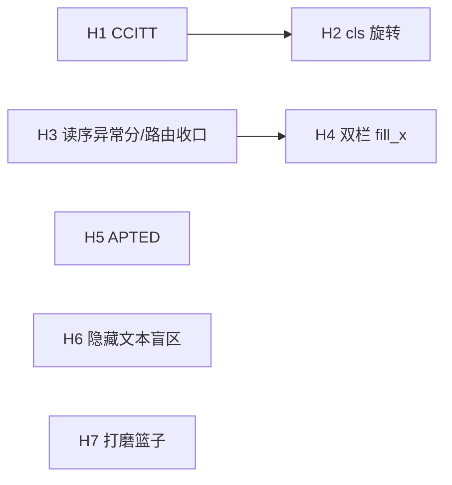

# 迭代计划 · Phase 5(H1–H7):健壮性纵深与质量债清偿

> 承接 [closing-docling-gaps.md](closing-docling-gaps.md)(Phase 4,G1–G9 可自主项已全部收官,2026-06-11)。
> 立项依据:**2026-06-11 待办重审**——滚动待办偏向新功能,把藏在代码 TODO 与旧计划未勾框里的健壮性债务漏掉了;本计划把它们捞回来,按"真实世界覆盖面 > 评测尺子 > 打磨"排序。
>
> **边界(延续)**:纯 Rust、确定性核心独立、模型可插拔(进程内 tract 或可选 OpenAI 兼容服务外接);主流程不渲染像素,难页增强按需渲染。本阶段**不追**:GPU、发布(用户暂缓)、为格式数铺货。

## 0. 来源 → 里程碑映射

| 债务来源 | 内容 | 里程碑 |
|---|---|---|
| images.rs TODO | CCITT/JBIG2/JPX 1-bit 扫描只记位置不解像素 → `--ocr`/转写对一大类真实扫描件失效 | **H1** |
| G4 未勾框 | 方向分类 cls 缺失 → 旋转扫描件 OCR 乱码(测试材料现成:data_scanned 三份 rotated) | **H2** |
| G2 未勾框 + M7 留空 | `--layout` 自动路由无判据(三个几何判据已败);quality 模块的读序异常分一直留空 | **H3** |
| layout.rs M3 TODO | 双栏左列不重排(fill_x 用页宽右缘,左栏永远够不着) | **H4** |
| next-iteration 未勾 | TEDS 仍是近似 proxy;span 入 IR 后,proxy 无法正确奖励 span 结构 | **H5** |
| N5a TODO | 隐藏文本检测两个盲区:同色文本、图像遮挡(防注入故事的已知缺口) | **H6** |
| 各处小 TODO | v5-mobile 自转、HTML charset、CMYK JPEG、MediaBox 继承、转写区域去重 | **H7** |

## 1. 里程碑

### H1 · CCITT/JBIG2 1-bit 扫描解码 — *模块 2/8* · 🎯 真实覆盖面最大缺口
真实世界扫描 PDF 大量使用 CCITT G4(传真压缩);现状 `ImageKind::None` 位置占位,整条 OCR/转写管线对其失效。

- [ ] **依赖征询**:纯 Rust CCITT 解码(候选 `fax` crate,MIT/Apache 系;JBIG2 纯 Rust 生态弱,先 CCITT、JBIG2 记边界);
- [ ] images.rs:CCITTFaxDecode 滤镜 → 1-bit 位图 → 扩展为 Gray8(`ImageKind` 复用,无 IR 变更);K 参数/BlackIs1/列宽对齐照 PDF 规范;
- [ ] e2e:找/造 CCITT 扫描样例(data_scanned 或 ImageMagick 造),`--ocr` 出文字;
- **验收**:CCITT G4/G3 扫描页经 `--ocr` 出正确文本;非 CCITT 路径零回归(三件套+记分牌);JBIG2/JPX 仍占位但 README 边界更新。

### H2 · 方向分类 cls(旋转校正)— *模块 8 / G4 余项*
- [ ] 模型获取:PP-OCR cls(~1.4MB)换源(ModelScope/官方转换/RapidOCR 系);拿不到则按计划文档化跳过;
- [ ] 接入:`--ocr` 路由的扫描图先过 cls(0/90/180/270)→ 旋转后进 det+rec;tract 加载沿 find_file;
- **验收**:`ocr_test_rotated_{90,180,270}.pdf` OCR 结果与 `ocr_test.pdf` 一致;未旋转样例零回归。

### H3 · 读序异常分 + `--layout` 自动路由最后一试 — *模块 3/7 / G2 收口*
三个几何判据已实测失败(行填充率/XY-cut 歧义/左缘覆盖,均有 devlog)。最后一个在案候选:**确定性输出的读序异常分**(块重叠率/读序回跳次数)——它同时补上 quality 模块(M7)留空的 reading-order 异常项。

- [ ] quality.rs:新增 `reading_order_anomaly`(页内块 bbox 重叠率 + 读序 y 回跳计数,纯几何、便宜);
- [ ] 用 amt/normal_4pages(--layout 赢)vs 2203/2305(--layout 输)验证判据可分性;
- [ ] 可分 → `--layout auto` 档按页自动;不可分 → **关闭确定性路由路线**,文档化"--layout 永久手动 + 页型判官归外接服务(按需)";
- **验收**:二选一明确落地;记分牌默认路径零回归。

### H4 · 双栏左列段落重排(fill_x 修复)— *模块 3 / M3 老债*
`group_blocks` 的续行条件要求前行触达 `fill_x`(页宽口径),双栏左列永远不满足 → 左列逐行成块、不聚段。

- [ ] 列感知 fill_x:按 X 直方图/已有 XY-cut 列切分推每列右缘;左列行以本列右缘判定续行;
- [ ] ⚠️ 高风险回归面(改动核心分组):三件套+双记分牌+全 e2e 必跑,单测覆盖单栏/双栏/表格混排;
- **验收**:2203/2305 左列段落聚合(肉眼+chunk 数下降);NID 双记分牌不降。

### H5 · TEDS 换精确 APTED — *评测尺子 / N4 余项*
当前 proxy(形状+行对齐 DP)已两次掩盖真实变化;span 入 IR 后只有树编辑距离能正确计分 span 结构。

- [ ] scripts/eval:树构造(table→行→格,span 折叠)+ APTED(纯 Python 实现或 `apted` 包,评测侧依赖不进产物);
- [ ] 与 proxy 并行输出一个过渡期,差异大的文档逐个核对(尺子换轨必须可解释);
- **验收**:APTED 列上线、proxy 保留对照;span 输出(--table-model)在 APTED 下不再被压扁口径反噬,数据记入 testresults。

### H6 · 隐藏文本检测盲区 — *模块 9 / N5a 余项*
- [ ] 同色文本:fill 色与背景色同(需追踪 `rg/g/sc` 填色态 + 页面底色启发);
- [ ] 图像遮挡:文本 bbox 被其后绘制的不透明图像完全覆盖;
- [ ] 两者都标 `hidden=true` 进现有审计通道;合成样例单测;
- **验收**:合成注入样例被拦截并可审计;真实文档零误杀(三件套+语料扫 hidden 计数无异常增长)。

### H7 · 打磨篮子(小 TODO 清偿)— *横切*
逐项小步,各自带回归:
- [ ] MediaBox 继承(Pages 树向上回溯,替换 US Letter 兜底);
- [ ] HTML charset(textio 探测接入 html 后端,meta charset 优先);
- [ ] CMYK JPEG(`--image-dir`/`--image-embed` 直通件转 RGB 或文档化);
- [ ] 转写区域重叠去重(相邻重复行);
- [ ] v5-mobile 自转(paddle2onnx 一次性工序,产出放 models/ 说明)。

## 2. 次序与依赖

**建议次序**:H1(覆盖面,需依赖征询)→ H2(材料现成)→ H5(先修尺子再动 H4 的核心分组——老教训)→ H3 → H4 → H6 → H7 穿插。每里程碑照 SDD:完成回填 devlog,记分牌即回归门。

## 3. 按需池(不排期,候触发)

- 行内公式(无区域信号,需行内检测器)/ G3b 确定性 span 推断(模型路径已通,低优);
- JATS / METS-ALTO(真实 bbox)/ TIFF;RTL 与韩文等多语种(需多语种模型,按需外接 OpenAI 兼容服务或换模型);
- Markdown/HTML 输出利用 span;人工真值评测集(用户决策);
- 发布族:PyPI / crates.io / MCP registry(用户暂缓);arXiv 千份压测、fuzz 24h(资源/排期)。
