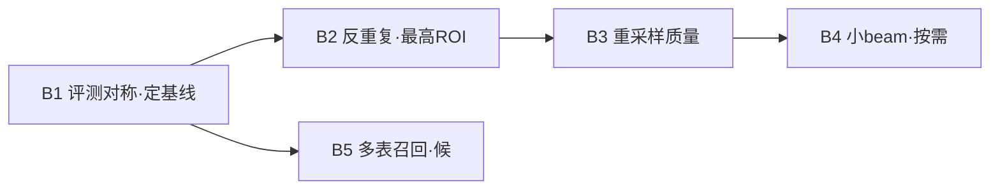

# 迭代计划 · Phase 6（B1–B5）：OmniDocBench 提分 —— 学术表识别纵深

> 承接 [hardening-iteration.md](hardening-iteration.md)（Phase 5 H1–H7 已收官，2026-06-12）。
> 立项依据：2026-06-12 提分调研。把记分牌、评测脚本（`scripts/eval/omnidocbench/`）、模型推理（`crates/docparse-ocr/src/unirec.rs`）、表精修（`table_model.rs`）、打分（`scripts/eval/score.py`）逐层过了一遍，结论高度集中。
>
> **✅ 收官状态（2026-06-12，主负结论）**：逐一探查解码侧便宜旋钮（loop-trim/area-resample/max_tokens），**全部 no-op 或反降**。学术表 0.517 是 **UniRec-0.1B 的真实识别天花板 + 评测口径反噬**（我们更忠实的拆行被粗标真值扣），**不是便宜/保速可动的**。落地两项零回归：**B1**（评测对称）、**B2**（EOS 门控失控退化抢救）；**B3/B4/B5 据证据否决/缓办**。数据见 [testresults/2026-06-12-omnidocbench-score-lift.md](../testresults/2026-06-12-omnidocbench-score-lift.md)，devlog [2026-06-12-b1b2-omnidocbench-score-lift.md](../devlogs/2026-06-12-b1b2-omnidocbench-score-lift.md)。逐里程碑结论见文末 §5。
>
> **边界（延续 Phase 4/5）**：纯 Rust、确定性核心独立、模型可插拔；主流程不渲染像素，难页按需渲染。本阶段**全部改动在 opt-in 的 `--table-model`/UniRec 路径与评测侧**——快路径（born-digital 无模型）速度身份零触碰。不追：GPU、自训模型、为格式数铺货。

## 0. 诊断 → 里程碑映射

OmniDocBench 学术子集代理 Overall ≈75 = `(text 87.2 + table 51.7 + formula 87.4)/3`。

text、formula 都已 ~0.87 论文级，**表是唯一离群项**。且表的**单模块**（GT 区直喂模型）学术子集就只有 0.517、全集 0.810——掉分**不在检测、在识别本身**（模型 + 我们的前后处理）。所以"提分 = 提学术表识别"，其余皆边际。详见调研结论。

| 诊断来源 | 内容 | 里程碑 |
|---|---|---|
| e2e_table_eval.py:63 vs table_eval.py:93 | 端到端表评测 pred 侧漏 `strip_math`，GT 侧有 → 含数学的格假性失配（评测管线不对称，lesson #1） | **B1** |
| unirec.rs:127–168 纯贪心 + looks_degenerate 整表丢弃 | 密集学术表 AR 退化重复环 → 现在事后丢弃回退确定性网格（更糟）；testresults 记"<0.4 失败 5、均值被 AR 退化拉低" | **B2** |
| table_model.rs:14 RENDER_SCALE=3.0 + unirec.rs:97 resize_bilinear | 整页 3× 双线性 → 裁剪 → 再双线性缩到 ≤960×1408，**两次重采样 + 下采样走样**，密集小字/细线糊 | **B3** |
| unirec.rs 解码贪心 only | 多级表头 span 决策贪心最易错；小 beam 提结构准确度（仅表路径，快路径零影响） | **B4**（按需，带速度代价） |
| e2e 单表页绕开匹配 | 官方 harness 多表学术页：DocLayout-YOLO 漏表=0；需量表区召回 + pred↔GT 匹配 | **B5**（候，真官方榜才需） |

**显式不追**：① text mobile 0.42 是档位选择非模型债（benchmark 文本门面用 `--transcribe-model` 0.87）；② formula 全集 0.708 差在非学术 + char-sim 代理本就低估真 CDM，对学术代理杠杆极小；③ born-digital 快路径已是强项，不为 benchmark 动其速度。

## 1. 里程碑

### B1 · 评测管线 strip_math 不对称修复 —— *评测侧* · 🎯 先做，定真基线
**改前先量**：现状 [e2e_table_eval.py](../../scripts/eval/omnidocbench/e2e_table_eval.py) 的 `ir_table_cells` 只过 `S._norm`，未过 `strip_math`；而 GT 的 [`html_to_cells`](../../scripts/eval/omnidocbench/table_eval.py) 过了 `strip_math`。UniRec 表单元里的数学（学术表大量）经 Rust `strip_tags` 保留 `\(...\)`，pred 带定界符、GT 不带 → 含数学格全部失配。

- [ ] e2e pred 侧单元文本统一过 `strip_math`（与 GT 对称）；只动评测脚本，**不动二进制**；
- [ ] 复跑 `e2e_table_eval.py`（学术子集 + 全集）、`table_eval.py` 学术子集，记录修正后真基线；
- **验收**：评测对称（pred/GT 同口径）；学术表 e2e/单模块真基线落档，作为 B2/B3 的对照起点。**B1 是诊断不是提分**——它把"管线假象"从"模型真实能力"里剥出来。

### B2 · 解码端反重复（no-repeat-ngram）—— *模块 8 / unirec.rs* · 🎯 最高 ROI，速度中性
现状贪心 + 事后 `looks_degenerate` 整表丢弃。密集学术表的重复环应在**解码时阻断**而非事后丢整表。

- [ ] [unirec.rs](../../crates/docparse-ocr/src/unirec.rs) 贪心循环：维护已生成 token 的 n-gram 集合，对会形成重复 n-gram（size=3，可调）的候选 token 做 logit `-inf` 屏蔽，取次优；纯 logit mask，零额外推理算力；
- [ ] 表/公式/转写三路共享（同 `recognize`）；`looks_degenerate` 保留为最后防线（屏蔽后仍退化才丢弃）；
- [ ] 单测：构造重复模式输入断言屏蔽生效；退化守卫不被新逻辑绕过；
- **验收**：学术表单模块 + e2e TEDS_X 较 B1 基线**升**（救回原本被丢弃/退化的难表）；三件套零回归；双记分牌默认路径逐字不变（快路径不走此码）；clippy 0、全单测绿。

### B3 · 渲染重采样质量 —— *模块 8 / table_model.rs + unirec.rs* · 速度中性
去掉"3× 双线性再下采样"的二次重采样糊化；下采样改区域均值（box/area）抗走样。

- [ ] 按表区大小选渲染 scale，使裁剪直接落近模型原生 ~960 宽，避免 `RENDER_SCALE=3.0` 整页渲染后再大幅下采样（[table_model.rs::refine_tables](../../crates/docparse-ocr/src/table_model.rs)）；
- [ ] `resize_bilinear` 下采样 >2× 时改区域均值滤波（[crate resize 工具](../../crates/docparse-ocr/src/lib.rs)），上采样仍双线性；单测钉死缩放正确性；
- **验收**：密集学术表 TEDS_X 较 B2 再升或持平（清晰度增益）；速度不退（更小渲染/同算力）；零回归门同 B2。

### B4 · 表路径小 beam（beam=2~3）—— *模块 8 / unirec.rs* · 按需，带速度代价
多级表头 span 贪心最易错。beam=2~3 提结构准确度，代价 2~3× 解码——**仅在 opt-in 表区**，快路径零影响。

- [ ] `recognize` 增 beam 参数（默认 1=贪心，向后兼容）；`--table-beam N` CLI 透传；beam 内复用 KV-cache（按 beam 维扩展 past）；
- [ ] 仅表任务默认启用小 beam（公式/转写仍贪心，避免整页转写翻倍耗时）；
- **验收**：beam=2 学术表 TEDS_X 较 B3 升，单表延迟仍 ≤ 个位数秒（opt-in 可接受）；默认 beam=1 路径与 B3 逐字不变；以增益/代价比定默认值去留。

### B5 · 多表学术页检测召回 + pred↔GT 匹配 —— *评测侧 + 模块 8* · 候，真官方榜
当前 e2e 只取单表页绕开匹配。官方 harness 学术页常多表，漏检=0。

- [ ] 量 DocLayout-YOLO 在学术页的表区召回（单独探针，先量后定是否值得做）；
- [ ] e2e 评测支持多表页 pred↔GT 最优匹配（复用 score.py 的贪心 max-sim）；
- **验收**：表区召回数落档；若召回是瓶颈再立子项，否则记弃权理由。**先量后做**（H3 死代码教训）。

## 2. 次序与依赖

**建议次序**：B1（先量，剥离管线假象）→ B2（救退化，最高 ROI，速度中性）→ B3（清晰度，速度中性）→ 视累计增益决定 B4 是否上 → B5 候真官方榜。每里程碑照 SDD：完成回填 devlog + testresults，**双记分牌 + 三件套 = 回归门**，OmniDocBench 学术表 TEDS_X = 提分门。

## 3. 验收总门

- **提分门**：学术表 TEDS_X（单模块 + e2e）较 B1 真基线显著升；代理 Overall 重算落档；
- **零回归门**（每里程碑必跑）：三件套（lorem/bialetti/1901.03003）逐字不变；双记分牌 NID 0.792/0.822 基线一致；clippy 0 warning；全单测绿；
- **速度门**：快路径不碰此码（结构性保证）；表路径单表延迟 B2/B3 不退、B4 在 opt-in 可接受范围。

## 4. 按需池（不排期）

- formula 真 CDM（渲染比对）替换 char-sim 代理；
- text mobile v5-server 抬 `--ocr` 档（非 benchmark 路径）；
- 官方 Python harness 逐项对标论文 90.57%；
- **真正提分杠杆（均在"内嵌+保速"身份域外）**：① 更大表模型（UniRec/OpenDoc 仅 0.1B，更大=更重）；② `--vlm-tables` 接 Qwen2.5-VL 级服务跑难表（已存在，非内嵌默认档）。

## 5. 收官小结（2026-06-12）

| 里程碑 | 结论 | 证据 |
|---|---|---|
| **B1 评测 strip_math 对称** | ✅ 落地（评测正确性，非提分手段） | e2e pred 侧补 `strip_math` 与 GT 同口径 |
| **B2 EOS 门控失控退化抢救** | ✅ 落地，**零回归**（学术 30 表逐字 0.517 不变） | 只碰"撞上限且无 EOS"的 runaway；首版激进 in-loop 早停误伤好表已废 |
| **B3 area 下采样** | ⊘ 否决/缓办 | tables 近中性；改公共预处理未验公式/转写零回归 |
| **抬输入分辨率 960×1408→1280×1792** | ✗ 否决 | 净 0.517→0.527（噪声）但救饥饿表=扭曲合身表，且 3× 慢破速度门；分辨率是真杠杆(#11 0→0.966)但 0.1B 对它脆 |
| **B4 小 beam** | ✗ 不投 | 主因=大表 UNDER-segment/超宽表 NO-PRED（分辨率/容量），beam 预期低收益 |
| **max_tokens 抬高** | ✗ 否决 | 2000→4000 实测 0.517→0.466（退化更久） |
| **B5 多表召回** | ⏸ 候真官方 harness | 单模块 0.517 封顶，检测非主瓶颈 |

**核心结论**：学术表 0.517 = **UniRec-0.1B 固定 960×1408 输入 + 容量在大/宽/密表上的真实天花板**（看图核对:#4/#16 是模型 over-split 错误**而非**评测口径反噬，初判已推翻）。逐旋钮(loop-trim/area/max_tokens/**分辨率**)证伪到能下定论:便宜/保速域无解。详见 [testresults](../testresults/2026-06-12-omnidocbench-score-lift.md) §3。
